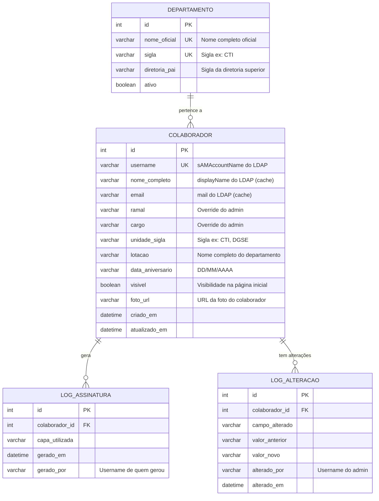
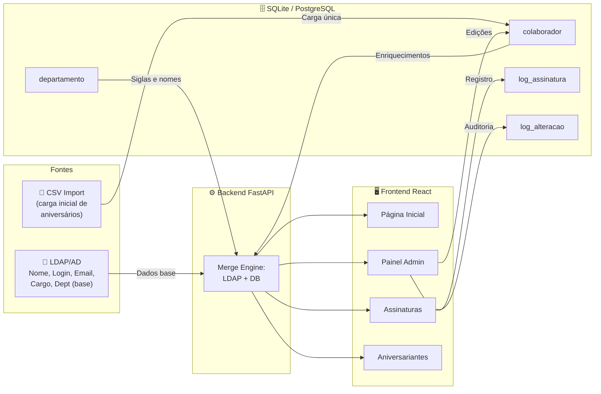

# 🗄️ Proposta de Banco de Dados — AEB Colaboradores

## Situação Atual vs. Proposta

Hoje o sistema usa **3 fontes de dados separadas** que não conversam bem entre si:

| Fonte Atual | O que guarda | Problema |
|---|---|---|
| `overrides.json` | Ramal, cargo, unidade, visibilidade, data de aniversário (edições do admin) | Arquivo JSON frágil, sem histórico, sem backup automático |
| `Aniversáriantes.csv` | Data de aniversário, nome, email, unidade (planilha externa) | Encoding inconsistente, sem validação, difícil de manter |
| **LDAP (Active Directory)** | Nome, login, email, cargo, departamento, foto | Somente leitura — não podemos gravar nele |

> [!IMPORTANT]
> A ideia é centralizar tudo que **não vem do LDAP** em um banco de dados relacional (SQLite para simplicidade ou PostgreSQL para produção), mantendo o LDAP como fonte primária de autenticação e dados base.

---

## Diagrama do Modelo



---

## Detalhamento das Tabelas

### 1. `colaborador` — Dados enriquecidos do colaborador

Substitui o `overrides.json` e o `Aniversáriantes.csv`.

| Coluna | Tipo | Obrigatório | Descrição |
|---|---|---|---|
| `id` | INTEGER | PK, auto | Identificador único |
| `username` | VARCHAR(100) | UNIQUE, NOT NULL | `sAMAccountName` do LDAP — chave de ligação |
| `nome_completo` | VARCHAR(255) | | Cache do `displayName` do LDAP |
| `email` | VARCHAR(255) | | Cache do `mail` do LDAP |
| `ramal` | VARCHAR(20) | | Ramal telefônico (editável pelo admin) |
| `cargo` | VARCHAR(255) | | Cargo/função (override do admin) |
| `unidade_sigla` | VARCHAR(20) | | Sigla da unidade: CTI, DGSE, ACI, etc. |
| `lotacao` | VARCHAR(255) | | Nome completo da lotação |
| `data_aniversario` | VARCHAR(10) | | Formato DD/MM/AAAA |
| `visivel` | BOOLEAN | DEFAULT TRUE | Se aparece na página inicial |
| `foto_url` | VARCHAR(500) | | URL ou path da foto |
| `criado_em` | DATETIME | DEFAULT NOW | Data de criação do registro |
| `atualizado_em` | DATETIME | DEFAULT NOW | Última atualização |

> [!TIP]
> O campo `username` é a **ponte** entre o banco e o LDAP. Ao carregar colaboradores, o sistema faz merge: dados base do LDAP + enriquecimentos do banco.

### 2. `departamento` — Tabela oficial de departamentos

Substitui o `siglas_departamentos.json`.

| Coluna | Tipo | Obrigatório | Descrição |
|---|---|---|---|
| `id` | INTEGER | PK, auto | Identificador único |
| `nome_oficial` | VARCHAR(255) | UNIQUE, NOT NULL | Ex: "COORDENAÇÃO DE TECNOLOGIA DA INFORMAÇÃO" |
| `sigla` | VARCHAR(20) | UNIQUE, NOT NULL | Ex: "CTI" |
| `diretoria_pai` | VARCHAR(20) | | Sigla da diretoria superior (ex: DPOA) |
| `ativo` | BOOLEAN | DEFAULT TRUE | Se o departamento ainda existe |

### 3. `log_assinatura` — Histórico de assinaturas geradas

Substitui os logs mockados da aba Logs do Admin.

| Coluna | Tipo | Obrigatório | Descrição |
|---|---|---|---|
| `id` | INTEGER | PK, auto | Identificador |
| `colaborador_id` | INTEGER | FK → colaborador | Quem teve a assinatura gerada |
| `capa_utilizada` | VARCHAR(255) | | Nome da capa/template |
| `gerado_em` | DATETIME | DEFAULT NOW | Quando foi gerado |
| `gerado_por` | VARCHAR(100) | | Login de quem gerou (admin ou próprio usuário) |

### 4. `log_alteracao` — Auditoria de mudanças

Registra quem alterou o quê e quando.

| Coluna | Tipo | Obrigatório | Descrição |
|---|---|---|---|
| `id` | INTEGER | PK, auto | Identificador |
| `colaborador_id` | INTEGER | FK → colaborador | Colaborador afetado |
| `campo_alterado` | VARCHAR(100) | NOT NULL | Ex: "ramal", "visivel", "cargo" |
| `valor_anterior` | TEXT | | Valor antes da mudança |
| `valor_novo` | TEXT | | Valor após a mudança |
| `alterado_por` | VARCHAR(100) | NOT NULL | Username do admin que fez a alteração |
| `alterado_em` | DATETIME | DEFAULT NOW | Data/hora da mudança |

---

## SQL de Criação (SQLite)

```sql
-- ============================================
-- Banco de Dados: AEB Colaboradores
-- Engine: SQLite (pode ser migrado para PostgreSQL)
-- ============================================

CREATE TABLE IF NOT EXISTS departamento (
    id              INTEGER PRIMARY KEY AUTOINCREMENT,
    nome_oficial    TEXT    NOT NULL UNIQUE,
    sigla           TEXT    NOT NULL UNIQUE,
    diretoria_pai   TEXT,
    ativo           BOOLEAN NOT NULL DEFAULT 1
);

CREATE TABLE IF NOT EXISTS colaborador (
    id                INTEGER PRIMARY KEY AUTOINCREMENT,
    username          TEXT    NOT NULL UNIQUE,   -- sAMAccountName (LDAP)
    nome_completo     TEXT,                      -- Cache do displayName
    email             TEXT,                      -- Cache do mail
    ramal             TEXT,
    cargo             TEXT,
    unidade_sigla     TEXT,                      -- FK lógica → departamento.sigla
    lotacao           TEXT,                      -- Nome completo do departamento
    data_aniversario  TEXT,                      -- DD/MM/AAAA
    visivel           BOOLEAN NOT NULL DEFAULT 1,
    foto_url          TEXT,
    criado_em         DATETIME DEFAULT CURRENT_TIMESTAMP,
    atualizado_em     DATETIME DEFAULT CURRENT_TIMESTAMP,
    
    FOREIGN KEY (unidade_sigla) REFERENCES departamento(sigla)
);

CREATE TABLE IF NOT EXISTS log_assinatura (
    id                INTEGER PRIMARY KEY AUTOINCREMENT,
    colaborador_id    INTEGER NOT NULL,
    capa_utilizada    TEXT,
    gerado_em         DATETIME DEFAULT CURRENT_TIMESTAMP,
    gerado_por        TEXT    NOT NULL,
    
    FOREIGN KEY (colaborador_id) REFERENCES colaborador(id)
);

CREATE TABLE IF NOT EXISTS log_alteracao (
    id                INTEGER PRIMARY KEY AUTOINCREMENT,
    colaborador_id    INTEGER NOT NULL,
    campo_alterado    TEXT    NOT NULL,
    valor_anterior    TEXT,
    valor_novo        TEXT,
    alterado_por      TEXT    NOT NULL,
    alterado_em       DATETIME DEFAULT CURRENT_TIMESTAMP,
    
    FOREIGN KEY (colaborador_id) REFERENCES colaborador(id)
);

-- Índices para performance
CREATE INDEX IF NOT EXISTS idx_colaborador_username ON colaborador(username);
CREATE INDEX IF NOT EXISTS idx_colaborador_unidade ON colaborador(unidade_sigla);
CREATE INDEX IF NOT EXISTS idx_log_assinatura_colab ON log_assinatura(colaborador_id);
CREATE INDEX IF NOT EXISTS idx_log_alteracao_colab ON log_alteracao(colaborador_id);
CREATE INDEX IF NOT EXISTS idx_log_alteracao_data ON log_alteracao(alterado_em);
```

---

## Dados Iniciais dos Departamentos

```sql
INSERT INTO departamento (nome_oficial, sigla, diretoria_pai) VALUES
    -- Presidência e órgãos vinculados
    ('PRESIDÊNCIA', 'PRE', NULL),
    ('CONSELHO SUPERIOR', 'CONSELHO SUPERIOR', 'PRE'),
    ('AUDITORIA INTERNA', 'AUDIN', 'PRE'),
    ('GABINETE', 'GAB', 'PRE'),
    ('SERVIÇO DE ASSISTÊNCIA ADMINISTRATIVA', 'SAA', 'GAB'),
    ('SERVIÇO DE ASSISTÊNCIA A OUVIDORIA', 'SEAD', 'GAB'),
    ('OUVIDORIA', 'OUV', 'PRE'),
    ('PROCURADORIA FEDERAL', 'PF', 'PRE'),
    
    -- Assessorias
    ('DIVISÃO DE ANÁLISE E PARECERES', 'DAP', 'PF'),
    ('ASSESSORIA DE COOPERAÇÃO INTERNACIONAL', 'ACI', 'PRE'),
    ('ASSESSORIA DE RELAÇÕES INSTITUCIONAIS E COMUNICAÇÕES', 'ARI', 'PRE'),
    ('COORDENAÇÃO DE RELAÇÕES INSTITUCIONAIS', 'CRI', 'ARI'),
    ('DIVISÃO DE APOIO INSTITUCIONAL', 'DAE', 'PRE'),
    ('COORDENAÇÃO DE COMUNICAÇÃO SOCIAL', 'CCS', 'ARI'),
    
    -- Unidades Regionais
    ('UNIDADE REGIONAL DE SÃO JOSÉ DOS CAMPOS', 'URSJC', 'PRE'),
    ('UNIDADE REGIONAL DO NATAL/RN', 'URRN', 'PRE'),
    ('UNIDADE REGIONAL DE ALCÂNTARA', 'URMA', 'PRE'),
    ('UNIDADE REGIONAL DE NATAL', 'URNN', 'PRE'),
    
    -- DPOA
    ('DIRETORIA DE PLANEJAMENTO, ORÇAMENTO e ADMINISTRAÇÃO', 'DPOA', 'PRE'),
    ('Divisão de Estratégia de Desenvolvimento Humano', 'DEDH', 'DPOA'),
    ('DIVISÃO DE PLANEJAMENTO E AQUISIÇÕES', 'DIPA', 'DPOA'),
    ('COORDENAÇÃO DE TECNOLOGIA DA INFORMAÇÃO', 'CTI', 'DPOA'),
    ('COORDENAÇÃO DE ORÇAMENTO E FINANÇAS', 'COF', 'DPOA'),
    ('COORDENAÇÃO DE GESTÃO DE PESSOAS', 'CGP', 'DPOA'),
    ('COORDENAÇÃO DE ADMINISTRAÇÃO', 'COAD', 'DPOA'),
    
    -- DIEN
    ('DIRETORIA DE INTELIGÊNCIA ESTRATÉGICA E NOVOS NEGÓCIOS', 'DIEN', 'PRE'),
    ('COORDENAÇÃO DE LICENCIAMENTO, NORMAS E COMERCIALIZAÇÃO', 'CLC', 'DIEN'),
    ('COORDENAÇÃO DE ESTUDO ESTRATÉGICOS E NOVOS NEGÓCIOS', 'CEN', 'DIEN'),
    ('COORDENAÇÃO DE DESENVOLVIMENTO DE COMPETÊNCIAS E TECNOLOGIA', 'CDT', 'DIEN'),
    
    -- DGSE
    ('DIRETORIA DE GOVERNANÇA DO SETOR ESPACIAL', 'DGSE', 'PRE'),
    ('COORDENAÇÃO DE POLÍTICAS E PROGRAMAS', 'CPP', 'DGSE'),
    ('COORDENAÇÃO DE MONITORAMENTO E AVALIAÇÃO', 'CMA', 'DGSE'),
    ('COORDENAÇÃO DE ESTRUTURA E GOVERNANÇA', 'CEG', 'DGSE'),
    
    -- DGEP
    ('DIRETORIA DE GESTÃO DE PORTIFÓLIO', 'DGEP', 'PRE'),
    ('COORDENAÇÃO DE SEGMENTO DE SOLO', 'CSS', 'DGEP'),
    ('COORDENAÇÃO DE SATÉLITES E APLICAÇÕES', 'CSA', 'DGEP'),
    ('COORDENAÇÃO DE VEÍCULOS LANÇADORES', 'CVL', 'DGEP');
```

---

## Fluxo de Dados com o Banco



---

## Vantagens sobre o modelo atual

| Aspecto | Hoje (JSON/CSV) | Com Banco de Dados |
|---|---|---|
| **Segurança** | Arquivo aberto no disco | Consultas parametrizadas, sem injection |
| **Concorrência** | Risco de corrupção se dois admins editam | Transações ACID garantidas |
| **Histórico** | Sem rastreio de mudanças | Tabela `log_alteracao` com auditoria completa |
| **Performance** | Lê arquivo inteiro a cada request | Índices e queries otimizadas |
| **Backup** | Manual | `sqlite3 .backup` ou pg_dump automático |
| **Escalabilidade** | Limitado a centenas de registros | Milhares sem impacto |
| **Importação** | CSV frágil com encoding problemático | Script de importação único, depois edição via Admin |

---

## Próximos Passos

1. **Escolher o engine**: SQLite (zero config, bom para até ~500 colaboradores) ou PostgreSQL (se quiser escalar)
2. **Criar o script de migração**: importar dados do `overrides.json` e `Aniversáriantes.csv` para o banco
3. **Refatorar o backend**: trocar `overrides_service.py` e `aniversariantes_service.py` por um `database_service.py` usando SQLAlchemy ou `sqlite3` direto
4. **Manter o LDAP**: continuar usando para autenticação e dados base — o banco só enriquece

> [!NOTE]
> Para o tamanho atual da AEB (~100-200 colaboradores), **SQLite é mais que suficiente** e não precisa instalar nada extra no servidor. Um único arquivo `.db` resolve.
